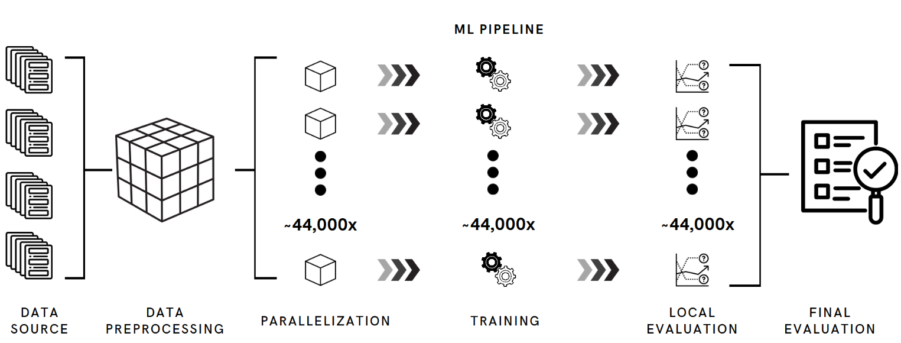

## Overview

This project forecasts the **aggregate hourly taxi demand for New York City pick-up locations, seven days in advance**. Unlike many projects using the NYC Taxi Trip dataset, this project sought to forecast city-wide demand across all taxi vendors, from 2015 - 2023 H1. This presented the critical challenge of processing 1.9 billion rows in the raw dataset to develop a predictive model.

Utilizing AWS EMR and S3, this project leveraged Apache Spark to train numerous ML models on specific groups in parallel, as opposed to a single model trained on the entire dataset. Collectively, these granular models formed a single system for all  of NYC. Each model was trained to predict the demand for a specific combination of the pick-up location, hour of the day, and day of the week. The resulting system is one that can predict demand for each node (ex. JFK Airport, 10AM, Monday). Compared to the naive baseline, test MAE was reduced by 15%. 

## Notes

This project was developed in AWS EMR studio and makes use of a non-public personal S3 bucket. The notebooks are therefore for preview purposes only and will not run without proper modifications.

## References

[AWS Marketplace: New York City Taxi and Limousine Commission (TLC) Trip Record Data](https://aws.amazon.com/marketplace/pp/prodview-okyonroqg5b2u#links) (accessed June 1, 2024).
